# Module 3 Practice Exercise Outputs

This page shows the rendered output of the 20 Module 3 practice exercises. Animated GIFs demonstrate the keyboard, mouse, idle, and timer callbacks used throughout the module.

## Easy Exercises

### Exercise Q01 - Display Your Name

Display the student's name as white bitmap text using `GLUT_BITMAP_HELVETICA_18`.

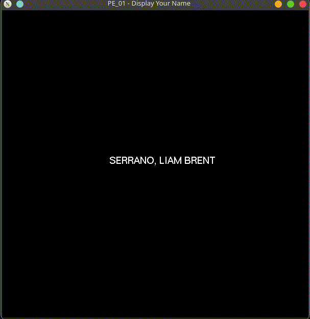

[Source code](SERRANO_PE_01.cpp)

### Exercise Q02 - Font Size Comparison

Display the same name with three different GLUT bitmap fonts.

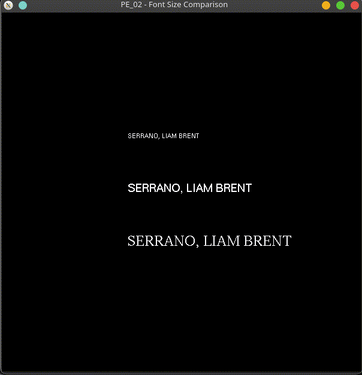

[Source code](SERRANO_PE_02.cpp)

### Exercise Q03 - Custom Window Setup

Create an 800 by 500 pixel window at the requested screen position.

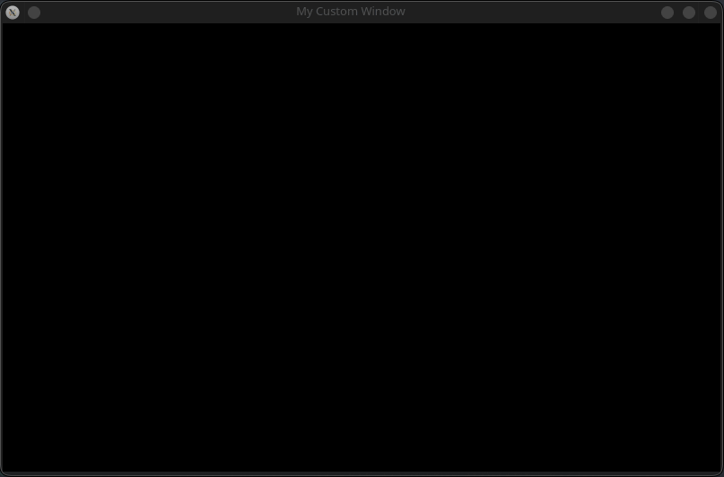

[Source code](SERRANO_PE_03.cpp)

### Exercise Q04 - Keyboard Background Color Switch

Use the `R`, `G`, and `B` keys to change the window background color.

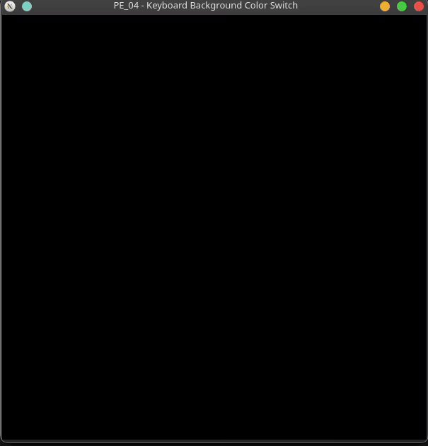

[Source code](SERRANO_PE_04.cpp)

### Exercise Q05 - Mouse Button Text Color

Show green text after a left click and red text after a right click.

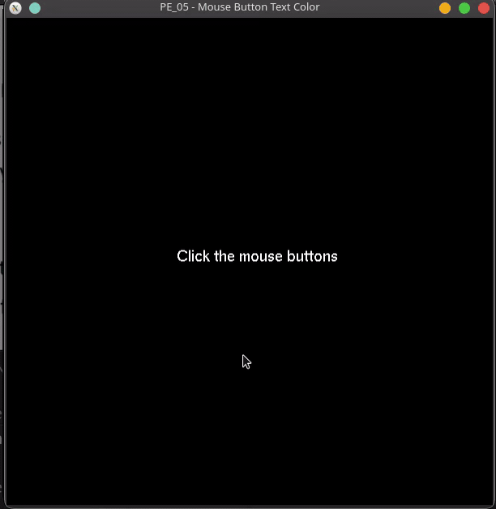

[Source code](SERRANO_PE_05.cpp)

### Exercise Q06 - Shape with Caption

Draw a filled triangle with a bitmap-text caption beneath it.

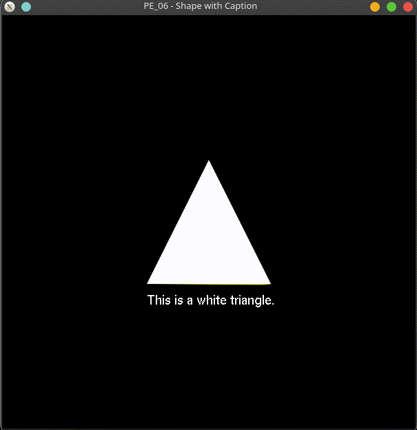

[Source code](SERRANO_PE_06.cpp)

### Exercise Q07 - Stroke Font Practice

Draw the letters `HI` with the scaled `GLUT_STROKE_ROMAN` vector font.

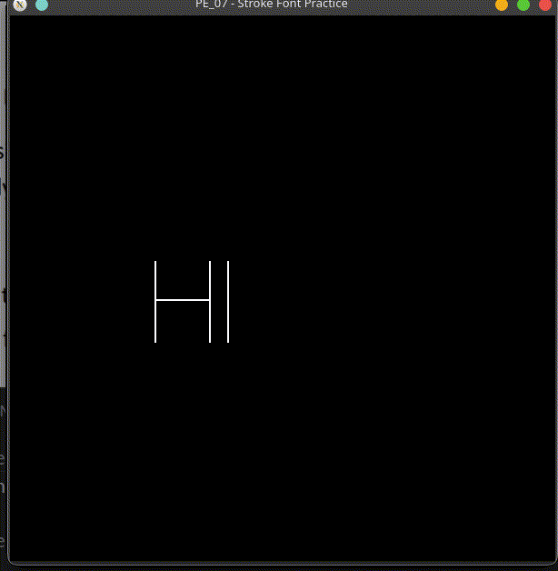

[Source code](SERRANO_PE_07.cpp)

## Medium Exercises

### Exercise Q08 - Clamped Keyboard Movement

Move a square left and right with `A` and `D` while keeping it inside the window.

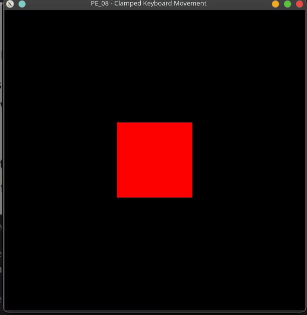

[Source code](SERRANO_PE_08.cpp)

### Exercise Q09 - Active Motion Coordinate Display

Display OpenGL-space cursor coordinates while a mouse button is held and dragged.

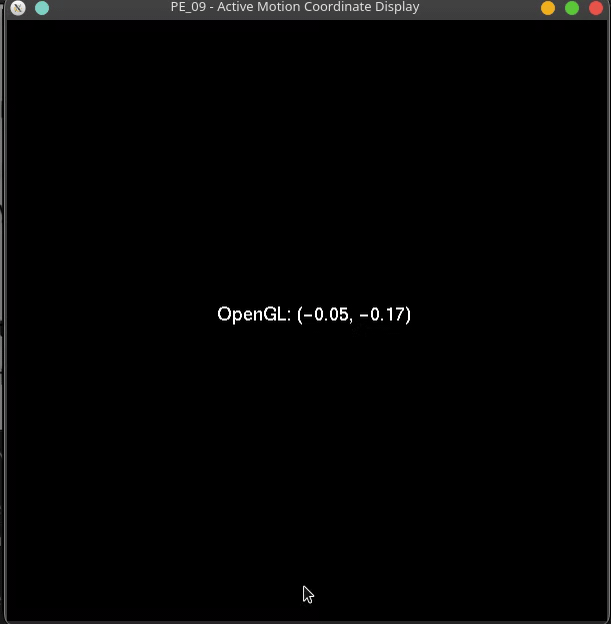

[Source code](SERRANO_PE_09.cpp)

### Exercise Q10 - Passive Motion Pixel Readout

Display raw pixel coordinates while the mouse moves without a button held.

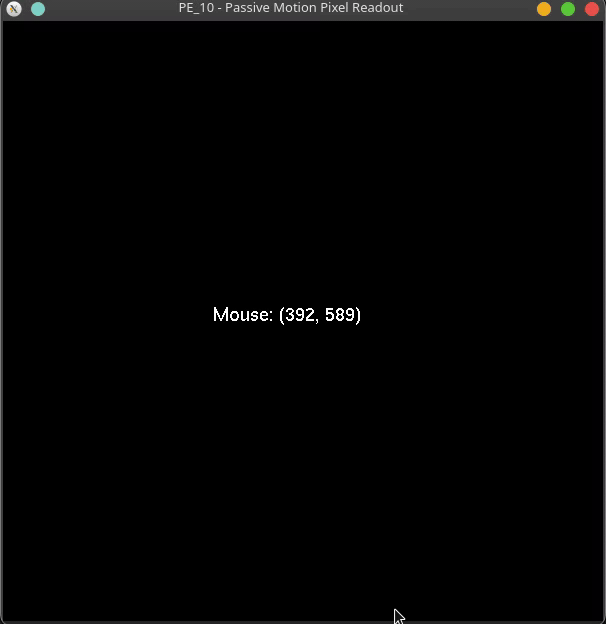

[Source code](SERRANO_PE_10.cpp)

### Exercise Q11 - Entry-Driven Background

Switch between light and dark gray as the pointer enters and leaves the window.

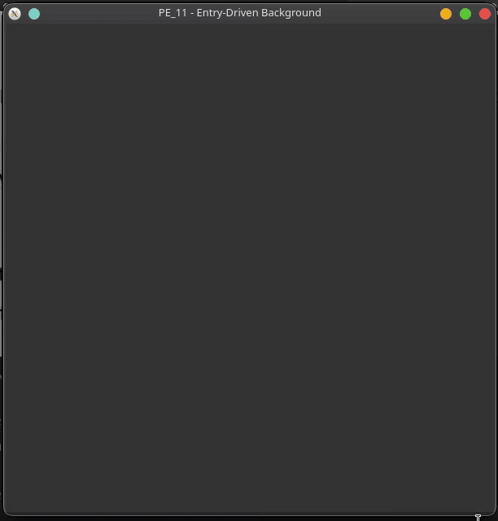

[Source code](SERRANO_PE_11.cpp)

### Exercise Q12 - Idle-Driven Bouncing Label

Animate a text label horizontally between the window edges.

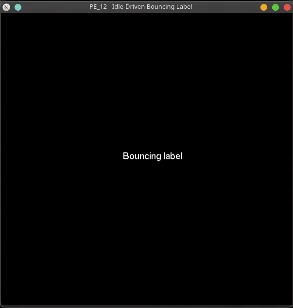

[Source code](SERRANO_PE_12.cpp)

### Exercise Q13 - Timer-Driven Counter

Increment and display a counter once per second with a repeating timer callback.

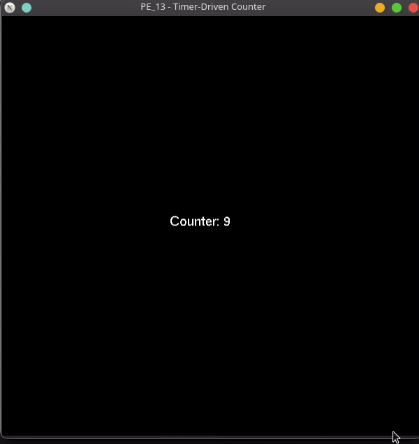

[Source code](SERRANO_PE_13.cpp)

### Exercise Q14 - Keyboard and Mouse Combo

Move a square vertically with `W` and `S`, then reset it with a mouse click.

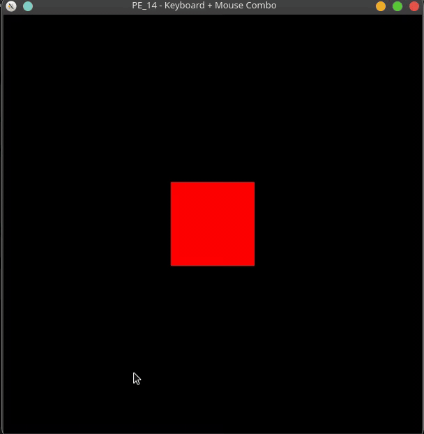

[Source code](SERRANO_PE_14.cpp)

## Hard Exercises

### Exercise Q15 - 30-Second Countdown Timer

Count down from 30 seconds, stop at zero, and display a completion message.

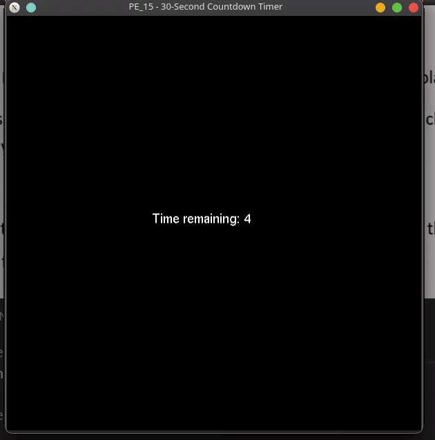

[Source code](SERRANO_PE_15.cpp)

### Exercise Q16 - Click-and-Drag Square

Move a square with the cursor only while the left mouse button is held.

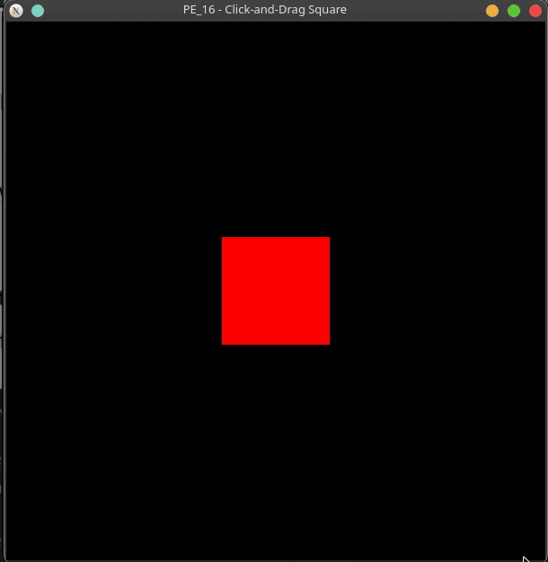

[Source code](SERRANO_PE_16.cpp)

### Exercise Q17 - Mouse-Controlled Stopwatch

Start or resume the stopwatch with a left click and pause it with a right click.

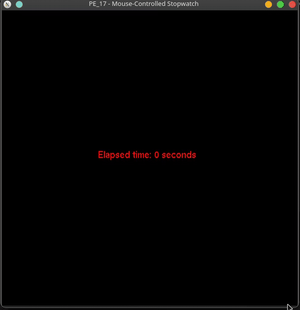

[Source code](SERRANO_PE_17.cpp)

### Exercise Q18 - Entry and Idle Freeze Combo

Animate a square horizontally while the pointer is inside the window and freeze it when the pointer leaves.

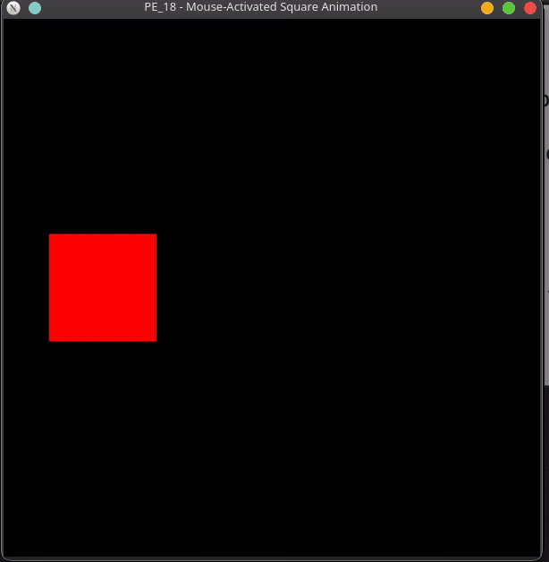

[Source code](SERRANO_PE_18.cpp)

### Exercise Q19 - HUD Score with Color Milestones

Increase a score with left clicks and cycle the square through red, green, and blue every five points.

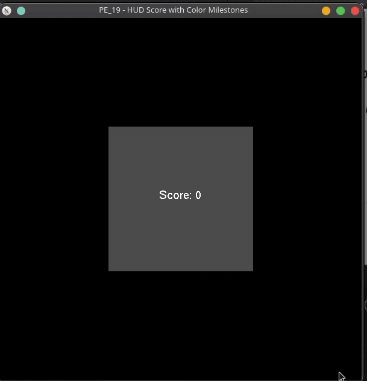

[Source code](SERRANO_PE_19.cpp)

### Exercise Q20 - Interactive Text Placer

Place or drag a pulsing square and label while displaying live passive mouse coordinates.

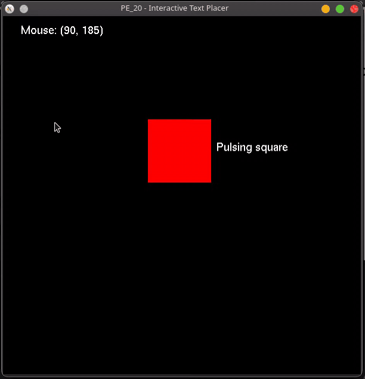

[Source code](SERRANO_PE_20.cpp)
