# Module 4 Practice Exercise Outputs

This page shows the rendered outputs of the 20 Module 4 practice exercises.

## Easy Exercises

### Exercise Q01 - Vertex Array X-Pattern Points

Convert an immediate-mode GL_POINTS block (5 points forming an X pattern with a center point) into a vertex array, using all 5 steps.

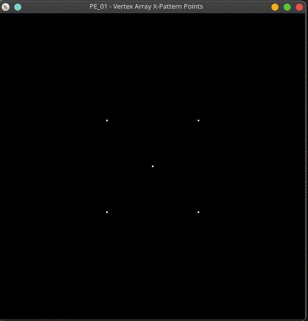

[Source code](SERRANO_PE_01.cpp)

### Exercise Q02 - Filled Hexagon via Vertex Array

Draw a filled, six-sided hexagon using GL_POLYGON via a vertex array, with 6 unique vertices of your own choosing.

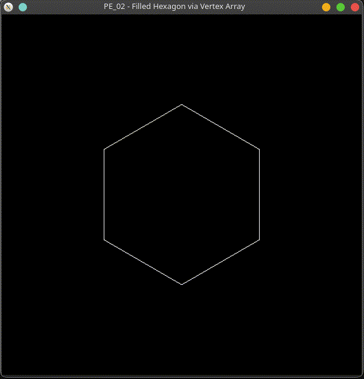

[Source code](SERRANO_PE_02.cpp)

### Exercise Q03 - Two Lines, One Array

Draw two separate GL_LINES segments from ONE vertex array and ONE glDrawArrays call (4 vertices total, grouped in pairs).

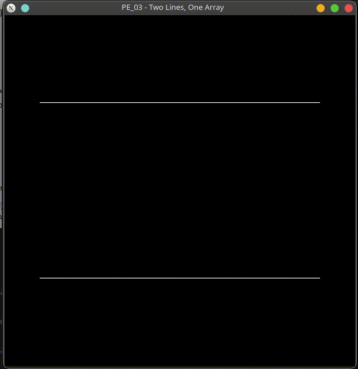

[Source code](SERRANO_PE_03.cpp)

### Exercise Q04 - Square Plus Outline, Same Array

Convert an immediate-mode filled square into a vertex array using GL_QUADS, then ALSO draw its outline using GL_LINE_LOOP with the SAME array (two draw calls, one array).

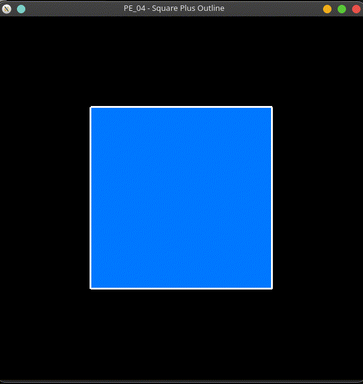

[Source code](SERRANO_PE_04.cpp)

### Exercise Q05 - GLint Vertex Data Type

Draw a triangle using a vertex array where the coordinates are stored as GLint (not GLfloat), scaled down with glScalef so it still fits within the -1..1 viewport.

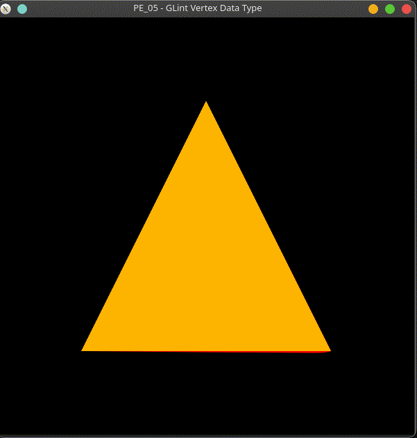

[Source code](SERRANO_PE_05.cpp)

### Exercise Q06 - glDrawElements Index Order

Draw a single triangle using glDrawElements with an index array, where the index order does NOT simply match the vertex array's storage order (e.g., indices {2, 0, 1} instead of {0, 1, 2}).

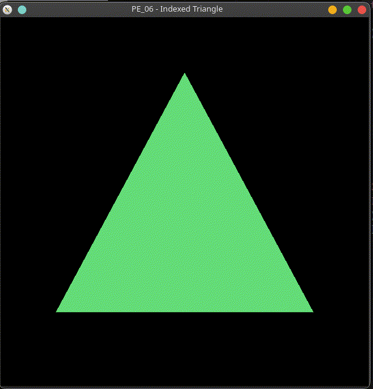

[Source code](SERRANO_PE_06.cpp)

### Exercise Q07 - Vertex + Color Array Triangle

Draw a triangle with a DIFFERENT color at each vertex, using a vertex array combined with a color array (not individual glColor3f calls).

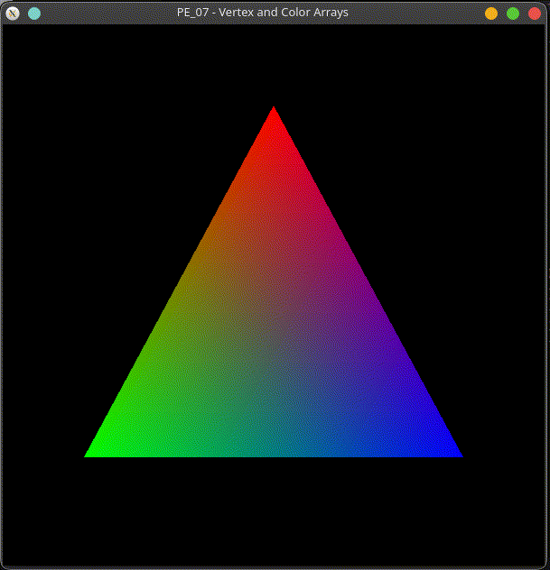

[Source code](SERRANO_PE_07.cpp)

## Medium Exercises

### Exercise Q08 - Three Triangles, One Array

Draw THREE separate triangles from one vertex array and ONE glDrawArrays call (9 vertices total).

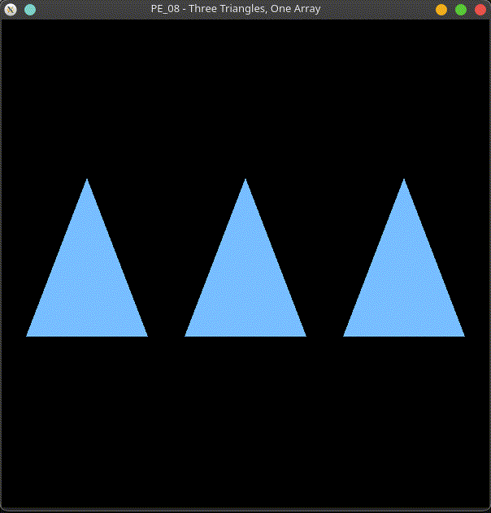

[Source code](SERRANO_PE_08.cpp)

### Exercise Q09 - Indexed Triangle Fan Pentagon

Build a pentagon from GL_TRIANGLE_FAN using glDrawElements, where the shared center vertex is stored only ONCE in the vertex array.

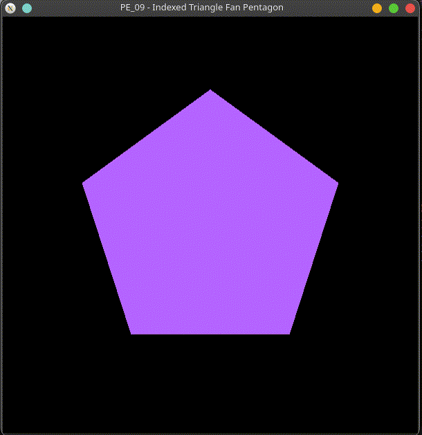

[Source code](SERRANO_PE_09.cpp)

### Exercise Q10 - Checkerboard Row via glDrawElements

Build a checkerboard-style row of 4 quads using glDrawElements, alternating black and white, sharing vertices between neighboring quads where the edges touch.

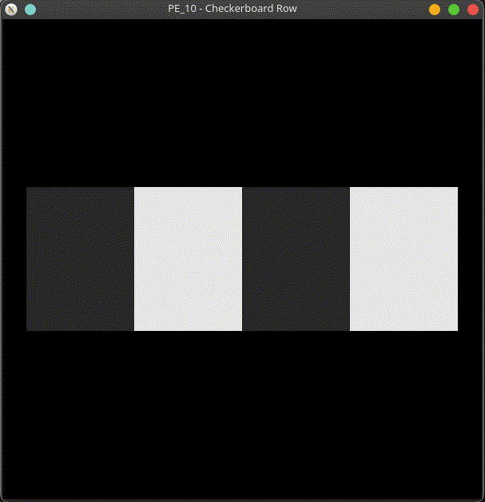

[Source code](SERRANO_PE_10.cpp)

### Exercise Q11 - Procedural Shaded Circle

Draw a smoothly shaded circle using GL_TRIANGLE_FAN, where BOTH the vertex array and the color array are filled in procedurally (using sin/cos and a loop), not hand-typed vertex by vertex.

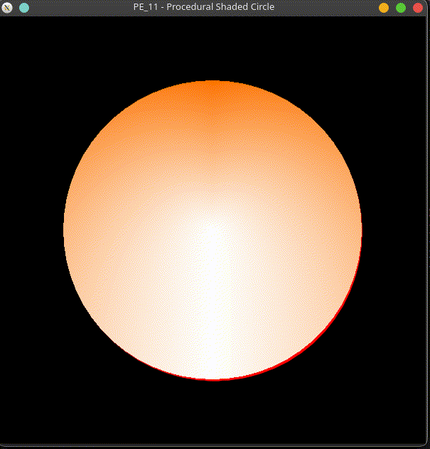

[Source code](SERRANO_PE_11.cpp)

### Exercise Q12 - Interleaved Array Quad

Build an interleaved position+color array for a quad (like Example 16), and render it using stride-based glVertexPointer/glColorPointer calls.

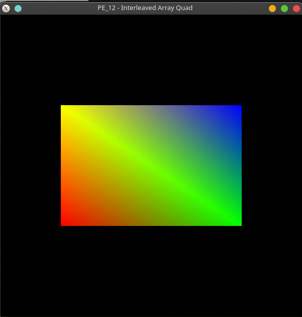

[Source code](SERRANO_PE_12.cpp)

### Exercise Q13 - Pinwheel via glDrawElements

Recreate the lecture's four-triangle pinwheel using glDrawElements INSTEAD of glDrawArrays, sharing the center vertex across all four triangles.

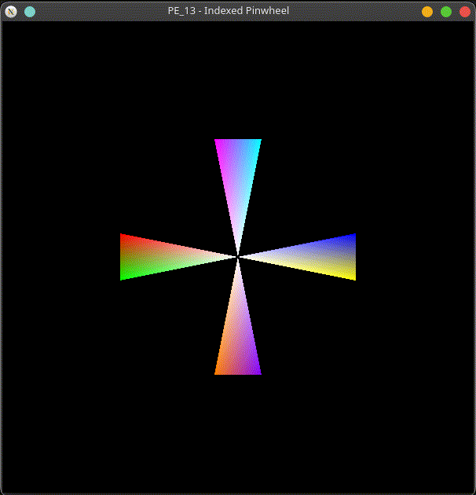

[Source code](SERRANO_PE_13.cpp)

### Exercise Q14 - Colored Quad Strip Staircase

Combine a GL_QUAD_STRIP 'staircase' shape with a vertex array AND a color array so each step is a different color, all drawn in ONE glDrawArrays call.

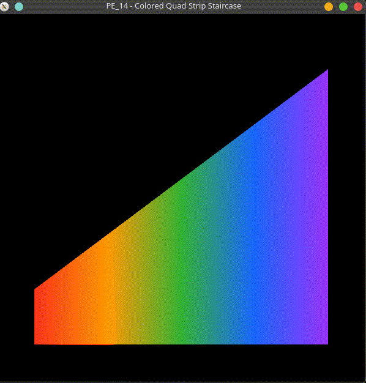

[Source code](SERRANO_PE_14.cpp)

## Hard Exercises

### Exercise Q15 - Fully Array-Based Scene

Build a full scene (at least 3 shapes: e.g., a sun, a mountain, and ground) where EVERY shape is drawn from vertex array data — no glVertex2f calls anywhere — mixing glDrawArrays and glDrawElements as appropriate for each shape.

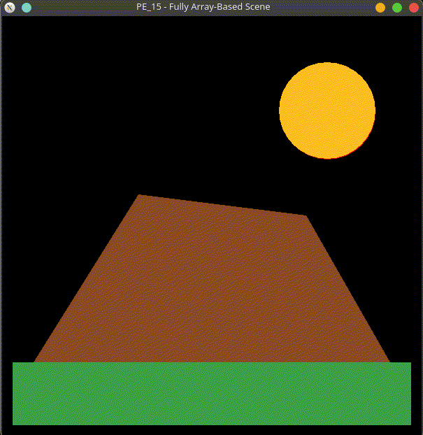

[Source code](SERRANO_PE_15.cpp)

### Exercise Q16 - glDrawArrays vs. glDrawElements, Side by Side

Draw the SAME quad twice, side by side: once with glDrawArrays (6 vertices, 2 duplicated), and once with glDrawElements (4 unique vertices + a 6-entry index array), so both approaches can be visually and numerically compared.

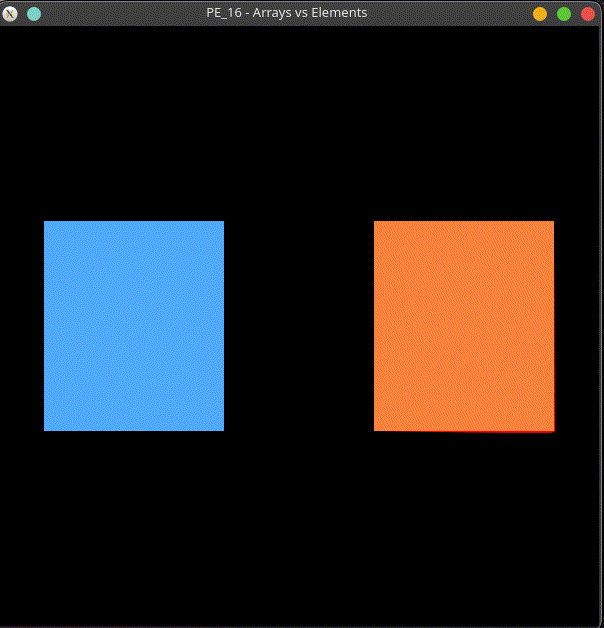

[Source code](SERRANO_PE_16.cpp)

### Exercise Q17 - Procedural Gear Shape

Build a procedurally generated ring of colored triangles (a simple 'gear' shape) using glDrawElements, where vertices are computed in a loop, and every other triangle uses a different color via TWO separate glDrawElements calls sharing ONE vertex pool.

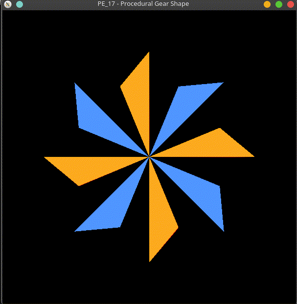

[Source code](SERRANO_PE_17.cpp)

### Exercise Q18 - Keyboard-Switched Vertex Arrays

Use glutKeyboardFunc so pressing '1', '2', or '3' switches which vertex array shape is displayed (a triangle, a quad, and a pentagon), WITHOUT rebuilding the arrays each time display() runs.

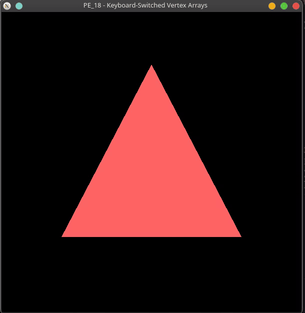

[Source code](SERRANO_PE_18.cpp)

### Exercise Q19 - Interleaved + Indexed Hexagon

Build an interleaved vertex+color array (position AND color in one array, like Example 16) for a hexagon rendered with glDrawElements AND a non-zero stride.

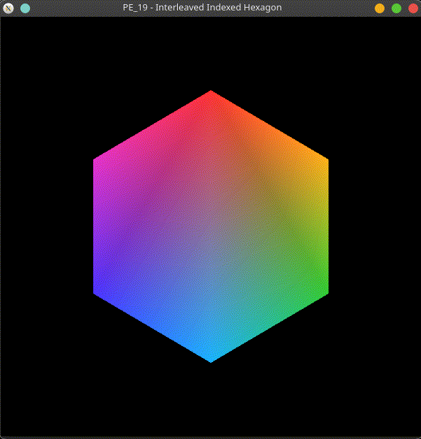

[Source code](SERRANO_PE_19.cpp)

### Exercise Q20 - Capstone: Procedural Flower Scene

Build a small procedurally generated 'flower' scene: a center disc (GL_TRIANGLE_FAN via glDrawElements), a ring of colored petals (GL_TRIANGLES via glDrawArrays with a vertex array + color array, generated in a loop, not hand-typed), and a ground quad.

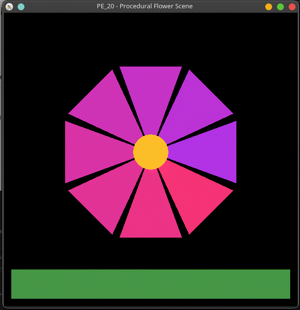

[Source code](SERRANO_PE_20.cpp)
