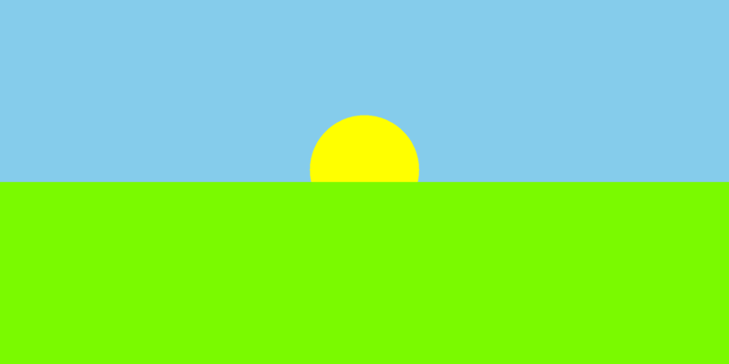

# CS0045 Computer Graphics and Visual Computing

This repository contains the laboratory work for **CS0045 Computer Graphics and Visual Computing**. The exercises begin with the basic OpenGL drawing pipeline, then gradually introduce procedural geometry, color, keyboard interaction, and animation through small programs that can be studied one concept at a time.

The code uses classic OpenGL with FreeGLUT so the early graphics concepts remain visible: creating a window, clearing the framebuffer, submitting vertices, choosing primitive types, and responding to events.

<p align="center"></p>

## Module 1 Introduction to Computer Graphics

Module 1 moves from a single point and line to compound scenes and interactive programs. It includes 20 guided examples, 20 mini-exercises, and 20 practice exercises.

The module focuses on:

- setting up an OpenGL and FreeGLUT window;
- drawing points, lines, triangles, and polygons;
- working with coordinates, colors, and smooth shading;
- generating shapes with loops and trigonometry;
- handling keyboard input; and
- creating simple frame-based animation.

Open the [Module 1 exercise gallery](Module1/README.md) to view every practice question alongside its captured output, including GIF demonstrations for animated and keyboard-controlled programs.

## Module 2 OpenGL Primitives and Color

Module 2 focuses on how OpenGL groups vertices into primitives and interpolates color between them. Its 20 practice exercises progress from points and lines to strips, fans, alpha blending, keyboard-controlled stippling, and procedural color generation.

The module focuses on:

- grouping vertices for points, lines, triangles, quads, and polygons;
- building connected geometry with line, triangle, and quad strips;
- generating fans and polygons with loops and trigonometry;
- applying per-vertex gradients and unsigned-byte colors;
- managing line stippling and alpha blending; and
- combining primitives into simple composed objects.

Open the [Module 2 exercise gallery](Module2/README.md) to view every practice exercise alongside its captured output.

## Working Through the Laboratory

1. Run the guided example for the topic and observe its output.
2. Read the source and identify the OpenGL calls responsible for the result.
3. Attempt the related mini-exercise as a short concept check.
4. Complete the practice exercise without copying the answer directly.
5. Compare the program window with the output shown in the exercise gallery.

The course materials are available here:

- [Module 1 manual with exercise outputs](Module1/docs/SERRANO_PE_M1.docx)
- [Module 1 practice exercises and outputs](Module1/README.md)
- [Module 2 student laboratory manual](Module2/docs/Module_02_Student_Laboratory_Manual.docx)
- [Module 2 manual with exercise outputs](Module2/docs/SERRANO_PE_M2.docx)
- [Module 2 practice exercises and outputs](Module2/README.md)

## Running a Course Activity

From the repository root, use `./run` with the module number, activity type, and activity number:

```sh
./run 1 e 2    # guided example 2
./run 1 m 3    # mini-exercise 3
./run 1 x 1    # practice exercise 1
./run 2 x 1    # Module 2 practice exercise 1
```

The activity types are `e` for guided examples, `m` for mini-exercises, and `x` for practice exercises. The command compiles the selected program and opens its GLUT window.

To compile a complete group without immediately opening each program:

```sh
make m1     # all Module 1 activities
make m1e    # guided examples
make m1x    # practice exercises
make m2     # all Module 2 activities
make m2e    # Module 2 guided examples
make m2x    # Module 2 practice exercises
```

Use `make help` for the full command list. Compiled programs are placed in the corresponding `build/Module1/` or `build/Module2/` folder.

## Course Folder Guide

- `Module1/example/` contains the guided programs discussed in the manual.
- `Module1/mini-exercises/` contains shorter concept checks.
- `Module1/SERRANO_PE_01.cpp` through `SERRANO_PE_20.cpp` contain the practice exercise solutions.
- `Module1/assets/outputs/` contains the screenshots and GIF demonstrations used by the gallery.
- `Module1/docs/` contains the laboratory manual and completed document copy.
- `Module2/example/` contains the Module 2 guided programs.
- `Module2/SERRANO_PE_01.cpp` through `SERRANO_PE_20.cpp` contain the Module 2 practice solutions.
- `Module2/assets/outputs/` contains the Module 2 screenshots used by its gallery and completed manual.
- `Module2/docs/` contains the Module 2 source manual and completed document copy.

The local toolchain requires a C++ compiler, GNU Make, OpenGL, GLU, and FreeGLUT. The provided build setup uses `g++` with C++17.
